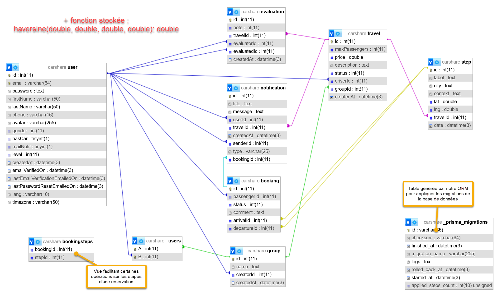

# Back-end
## Documentation
Vous pouvez trouver la documentation de l'API [ici](https://carshare.api.antoinectx.fr/docs).

Si le serveur n'est pas accessible, vous pouvez trouver la source de la documentation [ici](./docs/openapi.yaml).

## Développement
### Prérequis
Vous devez avoir les outils suivants installés sur votre machine :
* [Node.js](https://nodejs.org/fr/)
* [npm](https://www.npmjs.com/get-npm)
* une base de données MariaDB (vous pouvez utiliser [XAMPP](https://www.apachefriends.org/fr/index.html) pour l'installer sur votre machine)

### Installation
1. Cloner le dépôt et se placer dans le dossier [backend](.)
2. Installer les dépendances
```bash
npm i
```
3. Installer le paquet ***nodemon*** sur votre machine
```bash
npm i -g nodemon
```
4. Copier le fichier [`.env.example`](.env.example) et le renommer en `.env`
5. Modifier les variables d'environnement du fichier `.env` pour qu'elles correspondent à votre configuration
6. Copier le fichier [`mail.config.json.example`](mail.config.json.example) et le renommer en `mail.config.json`
7. Compléter le fichier `mail.config.json` avec les informations de votre serveur SMTP ou désactiver l'envoi d'emails en mettant `enabled` à `false`
8. Initialiser la base de données
```bash
npx prisma migrate deploy
```
9. Lancer le serveur
```bash
npm run dev
```
10. Créer un compte (sur le front ou directement dans la base de données)
11. Modifier le rôle de votre compte pour le passer en `Super Admin` (champ `level` dans la table `users` à `2`)

### Développement
Lorsque vous développez, lancez le serveur avec la commande suivante :
```bash
npm run dev
```
Le serveur sera lancé en mode développement et sera redémarré automatiquement à chaque modification des fichiers.


Pour lancer le linter et s'assurer que le code répond au style du projet :
```bash
npm run lint
```

Pour lancer le linter et corriger automatiquement certaines des erreurs détectées :
```bash
npm run lint -- --fix
```

## Production
Nous vous conseillons d'utiliser [Docker](#production--docker-) pour déployer le serveur en production.
D'autant plus que ***Prisma*** nécessite des permissions élevées pour fonctionner.

Si vous ne souhaitez pas utiliser Docker, vous pouvez utiliser [pm2](#production--pm2-) pour lancer le serveur en production.

### Production (Docker)
#### Prérequis
Vous devez avoir les outils suivants installés sur votre machine :
* [Docker](https://www.docker.com) ([tuto pour Linux en ligne de commande](https://www.digitalocean.com/community/tutorials/how-to-install-and-use-docker-on-ubuntu-22-04))
* un serveur web (Apache, Nginx, etc.)

#### Installation
1. Cloner le dépôt et se placer dans le dossier [backend](.)
2. Copier le fichier [`docker-compose.yml.example`](docker-compose.yml.example) et le renommer en `docker-compose.yml`
3. Modifier les variables d'environnement :
   * `MARIADB_ROOT_PASSWORD` du conteneur `db`
   * `DATABASE_URL` du conteneur `node`
   * `JWT_SECRET` du conteneur `node`
4. (optionnel) Modifier les ports des conteneurs si vous avez déjà des services qui utilisent ces ports
5. Copier le fichier [`mail.config.json.example`](mail.config.json.example) et le renommer en `mail.config.json`
6. Compléter le fichier `mail.config.json` avec les informations de votre serveur SMTP
7. Lancer les conteneurs
```bash
docker-compose up -d
```
8. Créer un compte (sur le front ou directement dans la base de données)
9. Modifier le rôle de votre compte pour le passer en `Super Admin` (champ `level` dans la table `users` à `2`)
10. Configurer le serveur web pour qu'il redirige les requêtes vers le serveur Node.js (reverse proxy)


### Production (pm2)
#### Prérequis
Vous devez avoir les outils suivants installés sur votre machine :
* [Node.js](https://nodejs.org/fr/)
* une base de données MariaDB
* un serveur web (Apache, Nginx, etc.)

#### Installation
1. Cloner le dépôt et se placer dans le dossier [backend](.)
2. Installer les dépendances
```bash
npm i
```
3. Installer le paquet ***pm2*** sur votre machine
```bash
npm i -g pm2
```
4. Copier le fichier [`.env.example`](.env.example) et le renommer en `.env`
5. Modifier les variables d'environnement du fichier `.env` pour qu'elles correspondent à votre configuration
6. Modifier la variable d'environnement `NODE_ENV` pour qu'elle vaille `production`
7. Copier le fichier [`mail.config.json.example`](mail.config.json.example) et le renommer en `mail.config.json`
8. Compléter le fichier `mail.config.json` avec les informations de votre serveur SMTP
9. Initialiser la base de données
```bash
npx prisma migrate deploy
```
10. Lancer le serveur
```bash
pm2 start dist/src/server.js --name "backend"
```
11. Créer un compte (sur le front ou directement dans la base de données)
12. Modifier le rôle de votre compte pour le passer en `Super Admin` (champ `level` dans la table `users` à `2`)
13. Configurer le serveur web pour qu'il redirige les requêtes vers le serveur Node.js (reverse proxy)

#### Quelques commandes utiles
Pour lancer le serveur en mode production sans pm2, exécuter la commande suivante :
```bash
npm run start
```

Pour nettoyer les fichiers générés pour le mode production, exécuter la commande suivante :
```bash
npm run clean
```

Pour accéder à la console de pm2, exécuter la commande suivante :
```bash
pm2 monit
```

## Base de données


### Modifications
Pour modifier la base de données, modifiez le fichier [`schema.prisma`](prisma/schema.prisma) puis exécutez la commande suivante :
```bash
npx prisma migrate dev
```
Un fichier de migration sera généré dans le dossier [`migrations`](prisma/migrations) et la base de données sera mise à jour.

> Pour plus d'informations sur les migrations, consultez la [documentation de Prisma](https://www.prisma.io/docs/concepts/components/prisma-migrate).

## Personnalisation supplémentaire
En plus des variables d'environnement, vous pouvez personnaliser le serveur en modifiant les fichiers suivants :
* [`translator.ts`](src/tools/translator.ts) pour modifier les messages (erreurs, succès, notifications, mails) envoyés par le serveur, ou ajouter des langues
* [`properties.ts`](src/properties.ts) pour modifier les propriétés utilisées par le serveur, notamment pour 
la vérification des champs, ou quelques éléments de protection (anti-spam, durée de validité des tokens, etc.)
