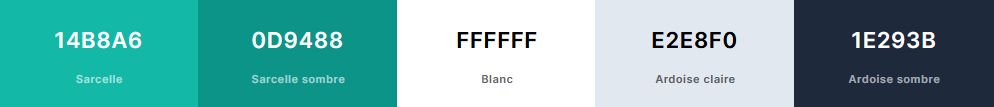
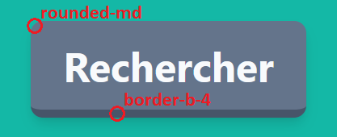

# Charte graphique du site web [`Car Share`]

## Couleurs
Une seule couleur principale utilisée dans le site web:
- La couleur **Sarcelle** (`#14b8a6`);
- Avec une variante **Sarcelle sombre** (`#0d9488`).

Pour les nuances de gris, ces couleurs sont utilisés:
- La couleur **Blanc** (`#ffffff`);
- La couleur **Ardoise claire** (`#e2e8f0`);
- La couleur **Ardoise sombre** (`#1e293b`).

## Formes
Les formes ont toutes une ligne directice:
- Une bordure inférieur assombie importante pour donner un effet de profondeur.
- Des bords arrondis pour un effet cartoon/professionnel

Ces bordures sont indiqués par le mot clé TailWindCSSS `border-b-4`.
Des bordures additionnelles peuvent être rajoutés au éléments, mais cela est déconseillé car l'effet de profondeur en sera amoindri.

Ces bordures ont une teinte légèrement assombie par rapport à la couleur de fond de l'élément, ainsi la couleur de fond:
- **Blanc** exigera une bordure de couleur **Ardoise claire**;
- **Sarcelle** exigera une bordure de couleur **Sarcelle sombre**.

Les bords arrondis sont quant à eux indiqués par le mot clé TailWindCSS `rounded-md`

## Elements
Plusieurs éléments graphique pré-faits sont à votre disposition pour créer les différentes pages du site web:
- ### Cartes
- L'élément `Card` vous permet d'entourer et regrouper visuellement des parties d'interfaces.
- L'élément `Modal` vous permet de créer une fenêtre sur l'écran avec des boutons d'actions `Annuler` et `Valider` pour créer des formulaires par exemple.
- L'élément `Popup` vous permet de créer une popup personnalisable avec des boutons d'actions `Annuler` et `Valider` s'affichant sur demande devant les élémentsde la page.
- ### Boutons
- L'élément `ButtonBlock` vous permet de créer un bouton personnalisable rempli de couleur pour attirer l'utilisateur sur l'action demandée
- L'élément `ButtonText` vous permet de créer un bouton textuel personnalisable pour proposer à l'utilisateur une action sans lui attirer d'attention particulière 
dessus.
- ### Entrées
- L'élément `InputText` vous permet de créer une zone d'entrée de texte d'une ligne, personnalisable. Cette entrée peut être changée en entrée de nombre, date, heure en précisant son attribut `type`.
- L'élément `InputChoice` vous permet de créer une zone de choix à une seule option, semblable a l'élément HTML `<select>`.
- L'élément `InputSwitch` vous permet de créer un interrupteur binaire, semblable à l'élément HTML `<checkbox>`.